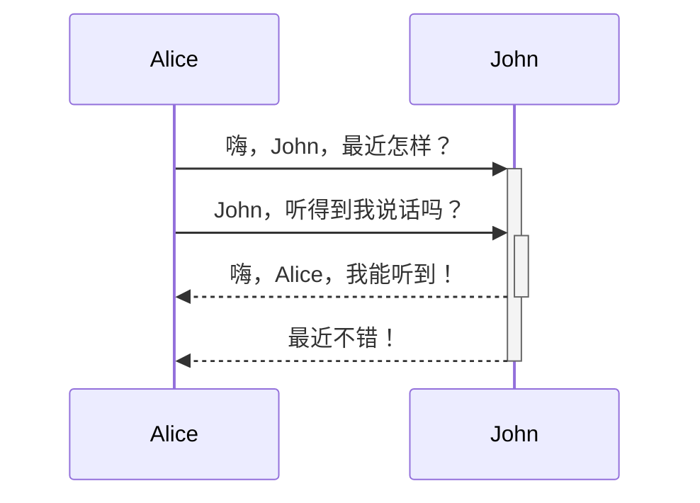

#markdown

1. 内部连接 [[Obsidian 学习笔记#学习笔记]]
 ^dbda02
2. 插入库文件 ![[_1.png|200]]
3. Obsidian URI [打开某篇笔记](obsidian://open?path=D:%2Fpath%2Fto%2Ffile.md) 
	需要转码为url

3. 题
# 1
## 2

4. 体强调
- 斜体*adf*
- 加粗**df**
- 斜体且加粗***asdfas***
- 高亮 ==adsf==
- 删除线 ~~sdsdfsfsf~~
5.  列表
	5.1 有序
	1. adafd
	2. adfa
	3. fadfa
	无序
	 - asdf
	 - adfaf
	 		- adfaf
	 		- adfasf
	 		- adfa
6. 插入外部文件		
	
	eg:
7. 引用格式
> Human beings face ever more complex and urgent problems, and their effectiveness in dealing with these problems is a matter that is critical to the stability and continued progress of society. \- Doug Engelbart, 1961	
8. 行内代码 ``priint()``
9. 代码块
```c#
void main(int arg)
{

}
```

10. 任务列表
	- [x] adfdsfg划掉
	- [?] compelete
	- [ ] 未完成 
11. 表格 （表格前一行必须空白）
	有3种对齐模式 :--      :---:  ---:  左中右对齐

| a | b |
|:--: |:--:|
|fadfaf|asfasffaf|
|fadfaf|sdf|

12. 脚注 [^22]

使用 Markdown[^1]可以效率的书写文档, 直接转换成 HTML[^1], 你可以使用 Typora[^2]g 编辑器进行书写。
[^1]:Markdown是一种纯文本标记语言
[^2]:HyperText Markup Language 超文本标记语言
[^T]:NEW WAY TO READ & WRITE MARKDOWN.
13. 数学公式
$$\begin{vmatrix}a & b\\ c & d \end{vmatrix}=ad-bc$$

14. 图表  Obsidian 通过 [Mermaid](https://mermaid-js.github.io/) 及其所提供的[编译器](https://mermaid-js.github.io/mermaid-live-editor)来为用户提供图表的绘制功能
>
	````



